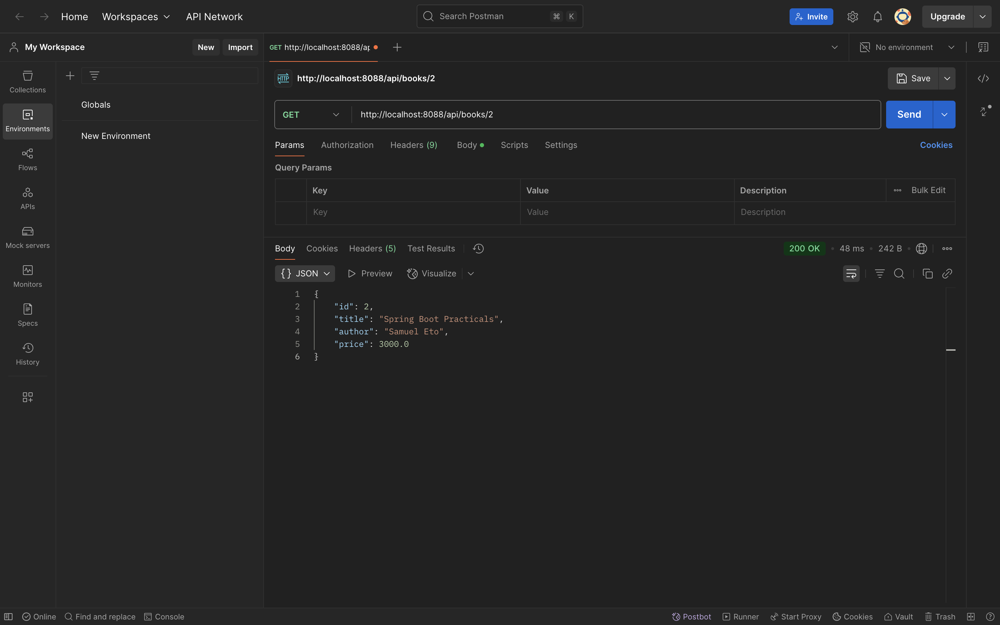

# SpringCRUD

A production-ready Spring Boot application implementing full CRUD operations on a **Book** entity (`id`, `title`, `author`, `price`) with PostgreSQL database integration.

---

## Tech Stack

- **Java 17**
- **Spring Boot 3.4.4**
- **Spring Data JPA**
- **PostgreSQL**
- **Maven** (build automation)
- **Lombok** (boilerplate reduction)
- **Springdoc OpenAPI** (Swagger UI integration)
- **Spring Boot Actuator** (application monitoring)
- **.env-java** (environment variable management)
- **Postman** (manual API testing)

---

## Project Structure


)

- **Controller Layer:** Handles incoming HTTP requests.
- **DTO Layer:** Defines payload structures for requests and responses.
- **Exception Layer:** Manages error handling globally.
- **Model Layer:** Represents the database entities.
- **Repository Layer:** Interfaces with the database.
- **Service Layer:** Contains core business logic.
- **BookStoreApplication:** Main Spring Boot Class.

---

## Setup Instructions

### Prerequisites

- Java 17 installed
- Maven installed
- PostgreSQL running locally
- Postman for Manual API testing

### Database Setup

Create the database:

```sql
CREATE DATABASE springcrud_db;
```

Create a `.env` file at the project root:

```env
DB_PASSWORD=your_postgres_password
```

### Application Configuration

Set in `application.properties`:

```properties
spring.datasource.url=jdbc:postgresql://localhost:5432/springcrud_db
spring.datasource.username=postgres
spring.datasource.password=${DB_PASSWORD}
```

> **Port:** Application runs on port `8088` for this project .

---

## How to Run

```bash
mvn clean install
mvn spring-boot:run
```

Swagger UI for interactive API testing:

```
http://localhost:8088/swagger-ui.html
```

---

## API Testing

- **Swagger UI** is integrated for in-browser testing.
- **Postman** was used for manual testing and verifying all endpoints.

### Endpoints Overview

| Method | Endpoint             | Description              |
|--------|----------------------|---------------------------|
| POST   | `/api/books`          | Create a new book         |
| GET    | `/api/books`          | Retrieve all books        |
| GET    | `/api/books/{id}`     | Retrieve a book by ID     |
| PUT    | `/api/books/{id}`     | Update an existing book   |
| DELETE | `/api/books/{id}`     | Delete a book             |

---

## Screenshots

### IntelliJ IDEA Application Testing
)

### Postman API Endpoints Testing




## Features

- Complete CRUD operations
- PostgreSQL database integration
- Environment-variable-based credential management
- Centralized error handling with custom exceptions
- Clean separation using DTOs
- Swagger UI + Postman testing support
- Health checks and metrics with Spring Boot Actuator

---

## Future Improvements

- Implement input validation in `BookRequest` DTO.
- Add pagination and sorting capabilities.
- Write unit and integration tests.
- Integrate Spring Security and JWT for authentication.
- Containerize the application using Docker.

---

## License

Open-source. Contributions and improvements are welcome.

---

## Author

Rashik Timalsina

